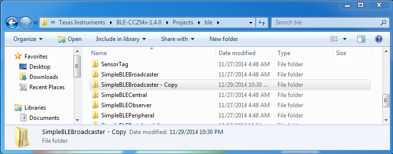
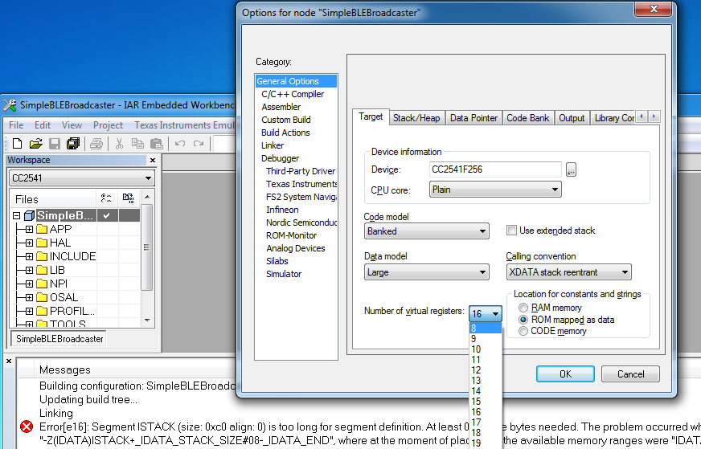

#This is uribeacon code for Texas Instrument CC2541/CC2540 platform. 

Here is a working code and hex file for Texas Instrument CC2541 platform. 
So UriBeacon can be played for TI platform users. 
Since no peripheral is used. This code should work on any CC2541 board.

##What you would need to try this without compiler

CC Debugger

A CC2541 board

Smart RF Flash Programmer


##How to compile this project.

You will need:

IAR Embedded Workbench for 8051

CC Debugger

A CC2541/2540 board

BLE-STACK 1.4.0

1.Duplicate "SimpleBLEBroadcaster" so you don't mess up orignal code



2.Compile SimpleBLEBroadcaster example and make sure it works well on your board.

If you see. "Segment ISTACK is too long" error in IAR 8.30, you can change "number of virtual registers" to 8



3.Change "static uint8 advertData[]" to:
```c
static uint8 advertData[] = 
{ 
  0x02,
  GAP_ADTYPE_FLAGS,
  GAP_ADTYPE_FLAGS_GENERAL|GAP_ADTYPE_FLAGS_BREDR_NOT_SUPPORTED,
  0x03,  // length
  0x03,  // Param: Service List
  0xD8, 0xFE,  // URI Beacon ID
  0x0A,  // length
  0x16,  // Service Data
  0xD8, 0xFE, // URI Beacon ID
  0x00,  // flags
  0xC5,  // power
  0x00,  // http://www.
  'A',
  'B',
  'C',
  0x00,  // .".com"
};
```
And change "advType" to "GAP_ADTYPE_ADV_NONCONN_IND", comment out "GAPRole_SetParameter( GAPROLE_ADVERT_OFF_TIME, sizeof( uint16 ), &gapRole_AdvertOffTime );" and "GAPRole_SetParameter( GAPROLE_SCAN_RSP_DATA, sizeof ( scanRspData ), scanRspData );"
```c
    uint8 advType = GAP_ADTYPE_ADV_NONCONN_IND;   // use non-connectable advertisements
    //uint8 advType = GAP_ADTYPE_ADV_SCAN_IND; // use scannable unidirected advertisements

    // Set the GAP Role Parameters
    GAPRole_SetParameter( GAPROLE_ADVERT_ENABLED, sizeof( uint8 ), &initial_advertising_enable );
    //GAPRole_SetParameter( GAPROLE_ADVERT_OFF_TIME, sizeof( uint16 ), &gapRole_AdvertOffTime );
    
    //GAPRole_SetParameter( GAPROLE_SCAN_RSP_DATA, sizeof ( scanRspData ), scanRspData );
```
Also you can change "DEFAULT_ADVERTISING_INTERVAL" to save some power
```c
#define DEFAULT_ADVERTISING_INTERVAL          1600
```

You can refer to "uriBeacon.diff" about all these changes.
