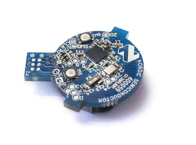

# Nordic nRF51822 UriBeacon

**This document provides instructions for over-the-air device firmware update (DFU) of the nRF51822-BEACON to UriBeacon firmware using an Android phone.**

## Getting Started

1. Purchase the [nRF51822 Bluetooth Smart Beacon Kit](https://www.nordicsemi.com/eng/Products/Bluetooth-R-low-energy/nRF51822-Bluetooth-Smart-Beacon-Kit) (part #NRF51822-BEACON)

2. Install one of the Nordic Android apps that support DFU: [nRF Master Control Panel (BLE)](https://play.google.com/store/apps/details?id=no.nordicsemi.android.mcp) or [nRF Toolbox for BLE](https://play.google.com/store/apps/details?id=no.nordicsemi.android.nrftoolbox)
3. Copy the [uribeacon nRF51822 firmware](uribeacon-nRF51822.hex) to your phone using  [Google Drive](https://play.google.com/store/apps/details?id=com.google.android.apps.docs) for Android or another method.

## Flashing UriBeacon

1. Put the hardware in Device Firmware Update mode by pressing SW1 and SW2 at the same time (green led will turn on). Hint: use a tool for pressing the small buttons, like a pen tip.
2. Use nRF Master (or nRF Toolbox) to upload the firmware file.

Steps for nRF Master:

1. Connect to tag with the name DfuTarg
2. Click on DFU tab in upper right hand corner
3. Select Application
4. Click on DFU
6. Click on select file and select Application
7. Select hex file from downloads on phone or from Google Drive
8. Click on Select Device
9. Select tag with the name DfuTarg
10. Click on Upload

## UriBeacon Configuration

After loading the firmware file, the tag will be in a dormant mode and will not transmit advertisement packets until it is configured.

1. Press SW2 on the tag to enter `CONFIG MODE.`
2. Using the [Physical Web](http://github.com/google/physical-web) Android App, input the desired Uri.

##nRF51822 UriBeacon Source code

Source code and project setup instructions can be found in the folder ble_uri_beacon.
