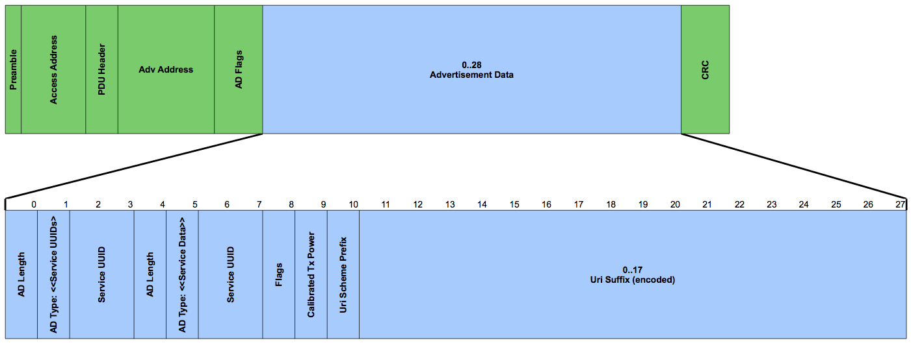

# UriBeacon Advertising Packet Specification

## Overview

The Uniform Resource Identifier Beacon (UriBeacon) defines Bluetooth 4.0 Advertisement Data that contain Web Uris. UriBeacon provides a way for Bluetooth Low Energy devices to discover nearby Uris, for example, provides a way for a user to discover a short Url and then download it on their smartphone.

UriBeacon is an open specification that is:

- licensed under the *Apache 2.0 License* and
adherent to the principles of the Open Internet and interoperable with the Open Web.
- not dependant on a specific hardware manufacturer, software vendor, mobile platform, user agent, web browser, or web service.

The UriBeacon Open Source Project aims to bring low power beacons into the family of Open Internet technologies. As such we forego private, exclusive and proprietary beacon solutions.

## Design Goals

1. Compliance with Bluetooth Specification Version 4.0 Advertising
Packet Data Unit (PDU).
1. Compatability with iOS and Android background scanning.
1. Efficiency in terms of power and wireless network utilization.

A subgoal of #3 is to use the Advertisement PDU Type `ADV_NONCONN_IND` (non-connectable undirected advertising PDU Type) where the “advertiser” simply sends advertisements and doesn’t interact with the receivers, and avoid `ADV_SCAN_IND` and the `SCAN_REQ` `SCAN_RSP` message exchange.

## UriBeacon Basic Types

The UriBeacon consists of two basic data types in an Advertising Data (AD) block: `<<Service UUID>>` and `<<Service Data>`. Both of these data types utilize a 16-bit Universally Unique Identifier (UUID)  allocated by the Bluetooth standards body for this purpose:

<table>
<tr>
  <th>Assigned Number</th><th>Service Name</th><th>Service Description</th>
</tr>
<tr>
  <td>
  0xFED8 
  (65240)
  </td>
  <td>
  Uniform Resource Identifier Service
  </td>
  <td>
  The Uniform Resource Identifier (Uri) Service provides a way for a Bluetooth Low Energy device to discover nearby identifiers for resources over a network, for example, provides a way for a user to discover a Url advertised by a Bluetooth Low Energy peripheral and then download it on their smartphone.
  </td>
</tr>
</table>

**Table 2:
[16-bit UUID Assigned Number for UriBeacon](https://www.bluetooth.org/en-us/Pages/LoginRestrictedAll/16-bit-UUIDs-member.aspx)
**

The `<<Service UUID>>` provides the mechanism for efficient, cross platform background scanning. Both Android and iOS allow background scanning for Services based on UUIDs.

The `<<Service Data>>` provides the mechanism for transporting the payload of Uri, Tx Power Level (for ranging), and flags.

## UriBeacon Advertising Data

The format for the Advertising Data that includes the `<<Service UUID>>` and `<<Service Data>>` basic types is shown in in Figure 1 and Table 3.

**Figure 1: UriBeacon Advertisement Data Format**

|Offset | Size | Value  | Name        | Description
|:----- | :--- | :----- | :---------- | :----------------
|0      |  1   | 3      | AD Length   |
|1      |  1   | 0x03   | AD Type     | Complete List of 16-Bit Service |Class UUIDs
|2      |  2   | 0xFED8 | Service ID  | Assigned Uri Service UUID
|4      |  1   | 5..23  | AD Length   |
|5      |  1   | 0x16   | AD Type     | Service Data
|6      |  2   | 0xFED8 | Service ID  | Assigned Uri Service UUID
|8      |  1   | -      | Flags       | UriBeacon Flags
|9      |  1   | -      | TX Power | UriBeacon Tx Power Level
|10     |  1   | -      | Uri Scheme  | UriBeacon Uri Scheme Prefix
|11     | 0..17| octets | Encoded Uri | UriBeacon Uri

**Table 3: UriBeacon Advertisement Data Format**

See [Generic Access Profile (GAP)
EIR Data Type and Advertising Data Type (AD Type) Values](https://www.bluetooth.org/en-us/specification/assigned-numbers/generic-access-profile)

### UriBeacon Flags

Bit   | Description
:---- | :----------
0     | Invisible Hint
1..7  | Reserved for future use. Must be zero.

The `Invisible Hint` flag is a command for the user-agent that tells it not to access or display the UriBeacon. This is a guideline only, and is not a blocking method. User agents may, with user approval, display invisible beacons.

### UriBeacon Tx Power Level

TX Power in the UriBeacon advertising packet is the received power at 0 meters.
The Transmit Power Level represents the transmit power level in
dBm, and the value ranges from -100 dBm to +20 dBm to a resolution of
1 dBm.

Note to developers: the best way to determine the precise value to put into this field is to measure the actual output of your beacon from 1 meter away and then add 41dBm to that. 41dBm is the signal loss that occurs over 1 meter.

#### Summary

The value is a signed 8 bit integer as specified by
[TX Power Level Bluetooth Characteristic](
https://developer.bluetooth.org/gatt/characteristics/Pages/CharacteristicViewer.aspx?u=org.bluetooth.characteristic.tx_power_level.xml).

#### Examples

* The value 0x12 is interpreted as +18dBm
* The value 0xEE is interpreted as -18dBm

### UriBeacon Uri Scheme Prefix

The Uri Scheme Prefix byte defines the identifier scheme, an optional prefix and how the remainder of the Uri is encoded.

|Decimal  | Hex        | Expansion
|:------- | :--------- | :--------
|0        | 0x00       | http://www.
|1        | 0x01       | https://www.
|2        | 0x02       | http://
|3        | 0x03       | https://
|4        | 0x04       | urn:uuid:

### UriBeacon urn:uuid: encoding

The `urn:uuid` identifier scheme is defined by RFC 2141, for example: `urn:uuid:B1E13D51-5FC9-4D5B-902B-AB668DD54981`.

The encoding consists of 16-octets representing the UUID in the form:

| Offset | Size | Description
| :----- | :--- | :----------------
| 0..15   |  16   | UUID in byte order

### UriBeacon HTTP URL encoding

The HTTP URL scheme is defined by RFC 1738, for example
`http://bit.ly/1tGYKCV` and is used to designate Internet resources
accessible using HTTP (HyperText Transfer Protocol).

The encoding consists of a sequence of characters. Character codes
excluded from the Url encoding are used as text expansion codes. When
a user agent receives the UriBeacon the byte codes in the Url
identifier are replaced by the expansion text according to the table
below.

|Decimal  | Hex        | Expansion
|:------- | :--------- | :--------
|0        | 0x00       | .com/
|1        | 0x01       | .org/
|2        | 0x02       | .edu/
|3        | 0x03       | .net/
|4        | 0x04       | .info/
|5        | 0x05       | .biz/
|6        | 0x06       | .gov/
|7        | 0x07       | .com
|8        | 0x08       | .org
|9        | 0x09       | .edu
|10       | 0x0a       | .net
|11       | 0x0b       | .info
|12       | 0x0c       | .biz
|13       | 0x0d       | .gov
|14..32   | 0x0e..0x20 | Reserved for Future Use
|127..255 | 0x7F..0xFF | Reserved for Future Use

Note: URIs are written only with the graphic printable characters of the US-ASCII coded character set. The octets 00-20 and 7F-FF hexadecimal are not used. See “Excluded US-ASCII Characters” in RFC 2936.

## References
- `Service UUID` type is defined in Core Specification Supplement, Part A, section 1.1
- `Service Data` type is defined in Core Specification Supplement, Part A, section 1.11

